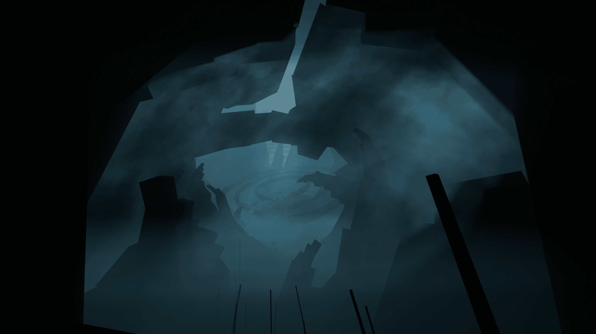
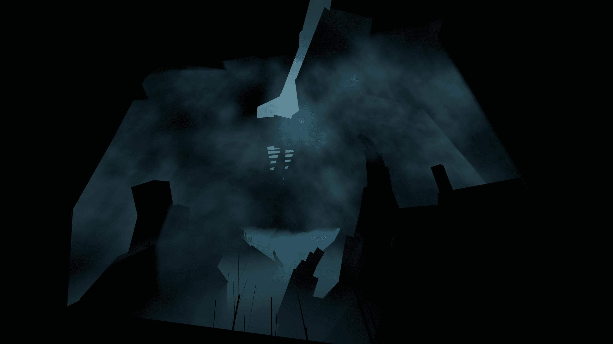

# Fog

On this page you can learn the basics behind fog in Beat Saber, an important aspect to consider when creating Custom Environments.

(Modified version of [nasafrasas in-depth fog guide](https://github.com/nasafrasa/MapScripts/wiki/RM3.4#fog))

## Basics

Fog is split into **two parts**:

**Atmospheric density (`attenuation` & `offset`)**  
: Atmospheric density deals with the fog that follows and is always around the player/camera.

**Height Fog (`startY` & `height`)**  
: Height Fog is fog that fades out **ALL** objects from a certain height onwards(1)
{ .annotate }

1. You can't change the height fog density as it will always have a point where the fog dissolves everything.

Both parts work together to create a neat fog effect without being *too* complicated.

### Attenuation

Attenuation is the intensity of the atmospheric density of the fog **between -1 and 1**   (0 and 1 for Quest) logarithmically(1). This is most often used for adding depth to an environment and making it feel more dynamic and alive.
{ .annotate }

1. There is a big change between 0.01 and 0.02, but barely any change between 0.1 and 0.2.    
   
   A basic logarithm function, 
   `y = log(x)`

??? info "Attenuation chart"
    <figure markdown="span">
      { width="350" }
      <figcaption>red text: attenuation   white text: distance of a geometry cube from the camera in blender units</figcaption>
    </figure>

***
### Offset
Offset is how far away the fog attenuation starts from the camera. The bigger the number, the further away the fog will start.

??? example "Offset examples"

    For simplicity, these diagrams are 2D instead of 3D. In-game this is not a circle, but a sphere around the camera.

    

    

    

    

***

### Height & Start Y

The `height` and `startY` fields work together to control the vertical (Y-axis) fog

**startY**   : Where all objects will be dissolved into the fog on the Y-axis

**height**   : The height of the fog gradient

> The `height` is relative to the `startY`.    For example, if `startY` was `-15` and `height` was `15`:   The fog gradient would **start at 0** (`-15 + 15`) and **end at -15**.  Every object under `Y -15` being completely dissolved.    These parameters can also be inverted!

??? example "Height fog examples"

    

    

    `startY`: -4   `height`: 4

    

    `startY`: -1   `height`: 2

    

    ***

    You can even invert the height and startY–You would usually use this for environments with full ground and caves.

    

    

    `startY`: 2   `height`: -3

    

## Tools

Here lies a some tools to help you out with anything related to fog

* Visualize how fog works in [Desmos](https://www.desmos.com/calculator/c59280c826) (Made by Swifter)

* Make experimenting with fog parameters in-game easier with the [MapperTools](https://github.com/ugecko/mappertools) mod. (Coming Soon)

## Map Examples

Below provides some examples of fog configurations by already published maps.

??? example "["Spells" published by Swifter](https://beatsaver.com/maps/35a0b)"
    **Normal**
    > This is the normal fog configuration that is set for the beginning of the map.

    

    **High Offset / Normal Attenuation**
    > Notice the change from no fog -> fog on farther objects.

    

    **0 Attenuation / Normal Offset**
    > With 0 attenuation at any distance, you get a scene that lacks depth.

    

    **0 Attenuation / Inverted startY + height**

    

??? example "["Flares" published by Nasafrasa](https://beatsaver.com/maps/37c24)"
    **Normal**
    > This is the normal fog configuration that is set for the beginning of the map.

    

    **High Offset / Normal Attenuation**
    > Notice the change from no fog -> fog on farther objects.

    

    **0 Attenuation / Normal Offset**
    > With 0 attenuation at any distance, anything above the height fog in this case lacks depth. 

    

    **0 Attenuation / Slightly increased startY / 0 height**
    > Heres a good example of how height works.. See how it looks like a plane on the bottom now? Thats because at the startY it will instantly interpolate to fully dissolved.

    

